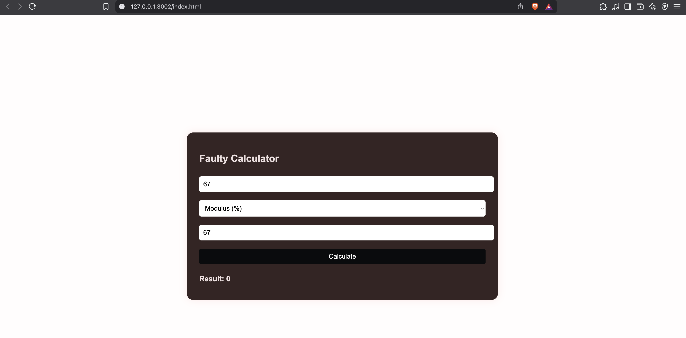

 🧮 Faulty Calculator

A fun web-based calculator that gives you the **wrong result 10% of the time** — just to mess with your brain 😄. Built using HTML, CSS, and JavaScript.

## 🔥 Features

- ✅ Basic operations: `+`, `-`, `*`, `/`, `%`, `**`
- ✅ Scientific functions: `sqrt`, `log`, `sin`, `cos`, `tan`
- ✅ 90% chance of giving the **correct** result
- ❌ 10% chance of using a **wrong operator** (randomly swapped)
- ⚠️ Handles edge cases like:
  - Division by zero
  - `0 / 0` (undefined)
  - Square root of negative number
  - Invalid inputs

---

## 🖥️ Demo

 
